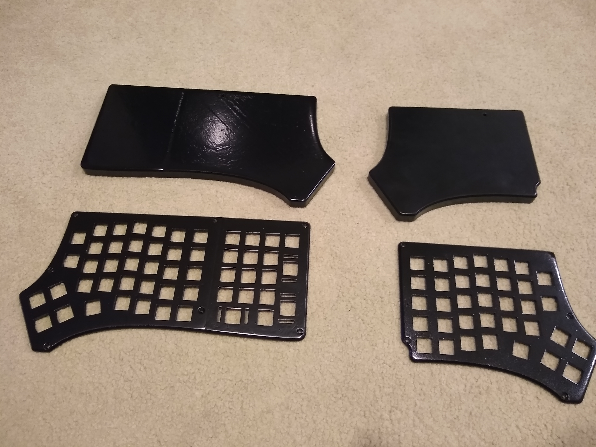
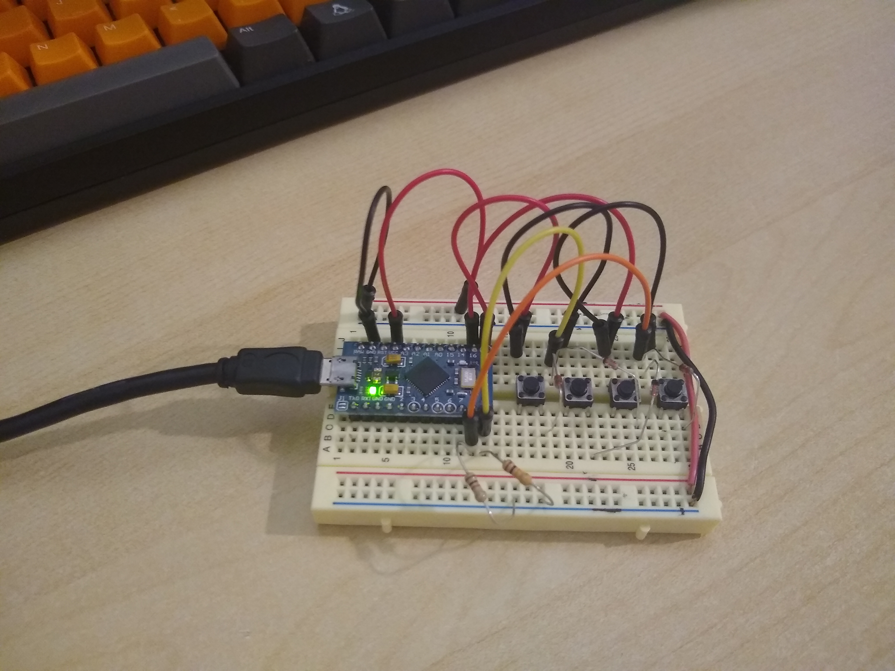
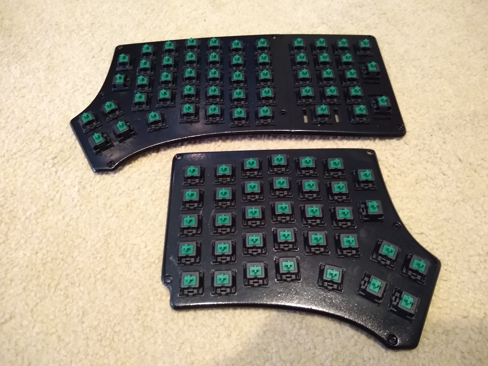
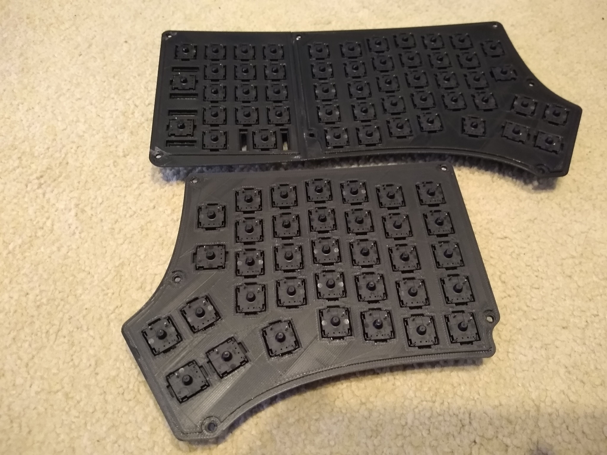
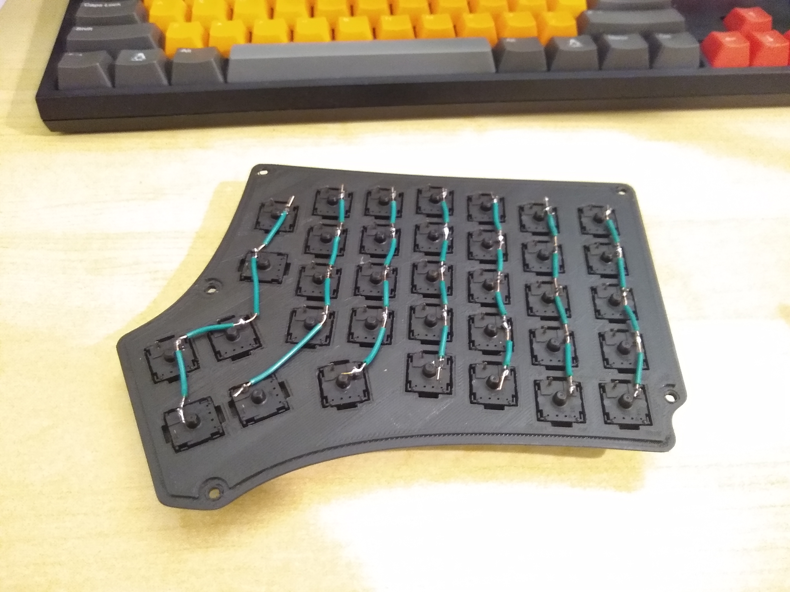
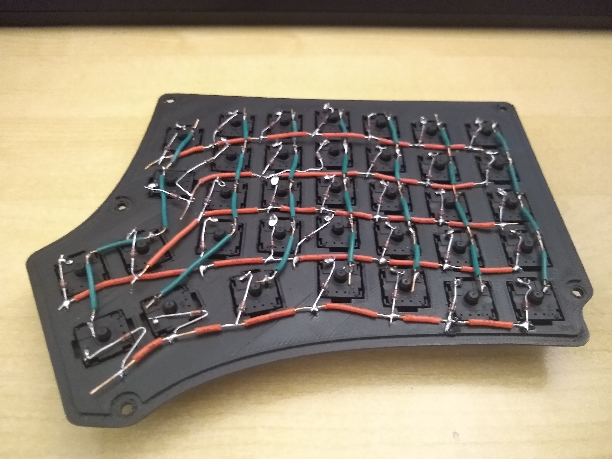
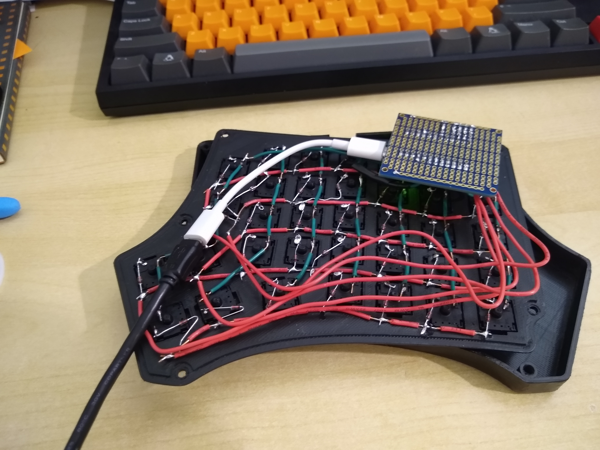
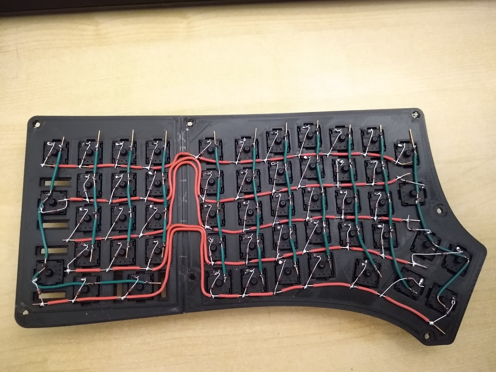
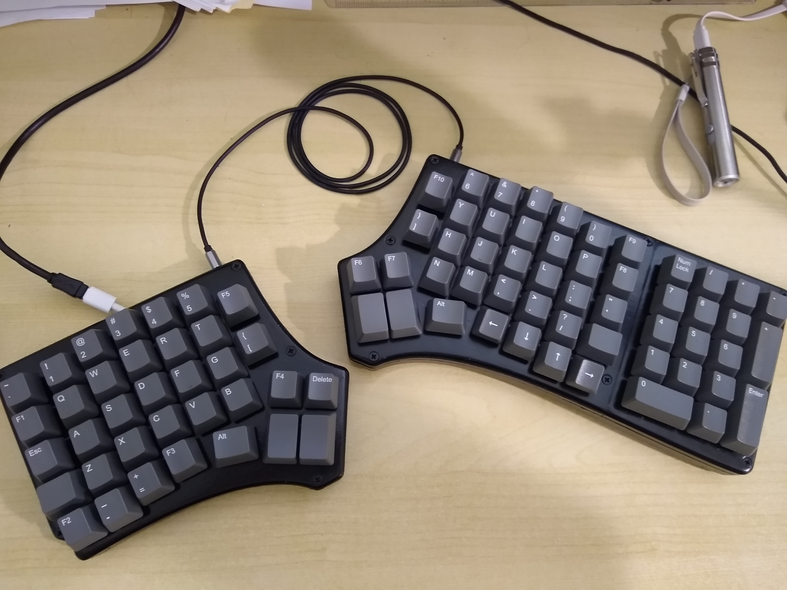
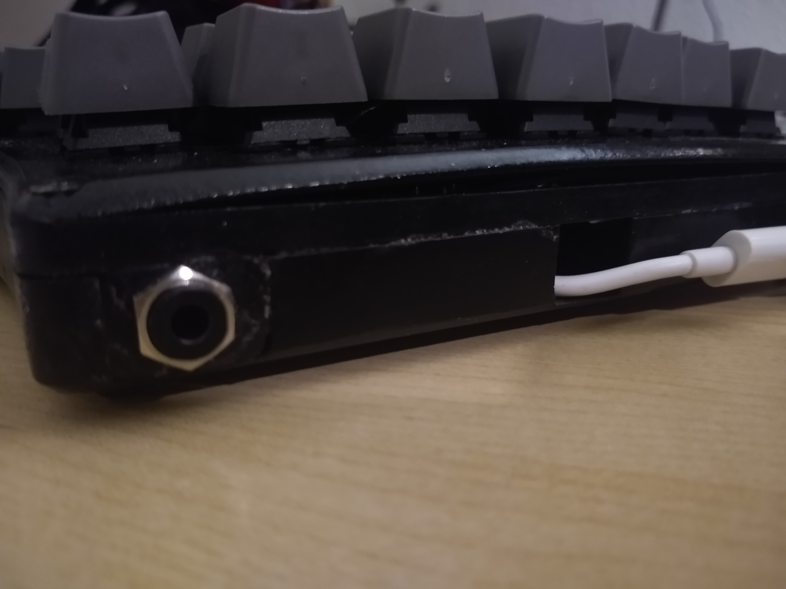

# Homemade Keyboard
Why buy a keyboard when I can make one for 3 times the cost!?

# Inspiration
While surfing the net a while back I came across [The Redox Keyboard](https://github.com/mattdibi/redox-keyboard). It's an open source split keyboard design with lots of great documentation. It was perfect for me since I just recently got a 3d printer and I've never dabbled into the keyboard making scene. Plus I've always thought split keyboards looked cool.

At the end of the project it cost me a little over $300 USD and about 3 weeks of hobby time to get the keyboard completed. The bulk of the price were the Cherry MX Green switches and keycaps, each cost me about $90 with shipping. As for time, the first week was spent adding a numpad to the right half of the keyboard, the second week soldering all the switches together, the last week was spent writing the software and tweaking it to my liking.

I decided to hand solder the keyboard for 2 main reasons. First, since I added the numpad I couldn't order one that was designed for the Redox (I have no idea how to desgn a PCB). Second, I'm really bad at soldering and even worse at soldering surface mount parts so I figured soldering about a million switches by hand would be easier.

I also decided to not use the [QMK](https://github.com/qmk/qmk_firmware) keyboard firmware simply because I write software for a living and writing code for a keyboard seemed like the easiest part of the project. (I know a pretty dumb reason)

# The Build
Since I wanted a numpad, the first step was finding a way to attach a numpad to the Redox design. I ended up finding one on [Thingiverse](https://www.thingiverse.com/thing:3682168) to base the design off of. I ended up opening the file in Blender and ripped it apart so that the only thing left were the holes for the switches. I then played with it some so that it looks like it would attach to the right side of the split. I don't have any progress gif/images but [here is final version](https://github.com/ToasterFuel/Keyboard/blob/master/Models/NumpadTop.stl) I ended up printing. I also made some small changes to the right side of the Redox design so that the corner would fit a little better. All models printed can be found in the [Models section](https://github.com/ToasterFuel/Keyboard/tree/master/Models) of the repo.

Once all the models were done being 3d printed, I glued the numpad and right sides together, sanded them down, spray painted them black, and then applied a layer of polyurethane. This was the part I was most surprised by since I'm still new to 3d printing and it was the first time I took the effort to properly sand down a model before painting and applying some kind of finish. It makes the final product look really good and almost professional (I know what a surprise!)

Next step was to test the wiring and software on a small scale. So I wired up 4 spare buttons in a 2x2 matrix like the final keyboard would and scrambled some code together. The only real problem I had here was keeping the GPIO pins a constant HIGH/LOW. If you look real close at the picture below you'll see some resistors in there that aren't in the original schematic (Let's be honest, those hooped wires make it impossible to follow what's going on in the picture). That's because I _really_ wanted the buttons to be active high. I have absolutely no reason other than that. I'm sure I could have used the internal pull up resistors in the Pro Micro to make the logic an active low but oh well. 

Before I start soldering I need to push in all the switches. I found out that the spray paint and polyurethane made the slots for the switches to be a tiny bit too small and it was very hard to push them in. I busted out my Dremel and sanded down every single hole. I feel like it would have been easier if I had a file but the Dremel worked.  

Now the soldering! Going into this project I've soldered about 3 things before, so I'm not good at it. As of writing this, I can proudly say that I didn't get any better with this project :D. The soldering is so simple and quick I didn't really learn anything new. Wait, that's a lie! I learned that you can take a knife and peel off the insulation of the wire so that you can get these cool sections that are exposed to be soldered to the switches.

I followed the schematic in the original design to solder the rows and columns into this very pretty mess. It gets a bit messier with the Pro Micro attached, but I'm pretty happy with how it looks. I wish I would have remembered to snap a picture of the protoboard before soldering it down so that you could see all the unnecessary pull up resisters I used.  

Once I got the left side soldered and loaded up with code, I was absolutely shocked that it worked immediately! I was so excited I woke up the sleeping wife to show her! To which she did not share my excitement nor wish to see the keyboard in action :( I like to think that my careful small scale testing helped make it work first try and it wasn't at all the fact that someone else already made the schematic for me. Anyway, soldering the right side was the same process as the left: rows and columns. 

As I went to assemble the halfs I hit the only major problem of the project: the original design expected me to use a PCB and the extra resistors/protoboard made it so that the top would not fit to the bottom. I ended up designing, printing, sanding, painting, finishing, and gluing 0.5 cm spacers for each piece so that the top would be set a little bit higher. [Links to](https://github.com/ToasterFuel/Keyboard/blob/master/Models/LeftKeyboardSpacing.stl) [the](https://github.com/ToasterFuel/Keyboard/blob/master/Models/RightKeyboardSpacing.stl) [spacings](https://github.com/ToasterFuel/Keyboard/blob/master/Models/NumpadSpacing.stl)

I also printed a [filling for the 3.5mm jack](https://github.com/ToasterFuel/Keyboard/blob/master/Models/HolePatch.stl) so that it has something to latch onto rather than just hanging out.

Final product! Please ignore the laser pointer in the picture 

# Improvements
I'm actually very happy with how the keyboard turned out. Sanding, painting, and applying the polyurethane made the keyboard look pretty good by my standards. Sparkfun's Pro Micro is very easy to use. Major props to them for putting the pin numbers on the PCB. It was a huge quality of life improvement that I haven't actually seen on any other micro controller. However, if I were to make another Redox keyboard in the future here are the things I think I could improve.

1. Don't print with PLA. PLA is the cheapest material for my printer, but that also means it has the lowest melting point. So low, in fact, that the plastic can bend and warp if left in direct sunlight. This actually happened with the first spacers I printed and left outside to dry. I've always liked how stained wood looks, maybe I'll find someone with a CNC machine to carve a case out for me? (If you look at the picture below, the top piece is bending pretty bad. This is actually from me stuffing the very large resistors/protoboard in the casing and not warping froom the sun)
2. Print the bottom as a single piece. There's a seam where I glued the spacers and the 3.5mm jack. I'd love if these weren't there. 
3. When I bought keycaps I just bought a full set of 104 caps and just placed them where they fit. This means I have a decent amount of extra caps that if I had taken the time to map out I probably wouldn't have needed to buy.
4. I get a double key press every once and awhile. I haven't dove into this issue yet so I have no idea if it's a wiring problem or a software problem. It could actually be a finger/switch problem too since I've noticed the more I use this keyboard the less I'm finding double key input. I've also found that the harder I press the keys the more double letters I find.
5. Adding a little tilt. I've always liked my keybaords with a little step in the back so I wouldn't mind figuring out the best angle to tilt this keeb.

Thanks for reading all the way down here :)
